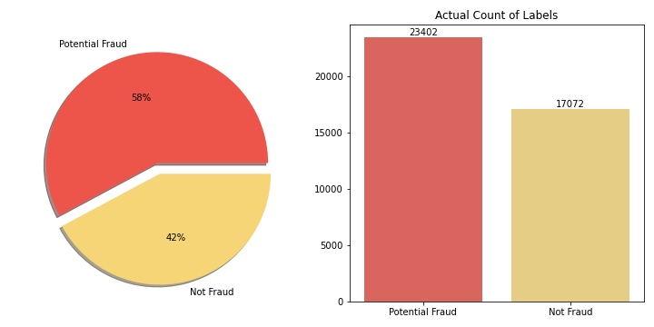
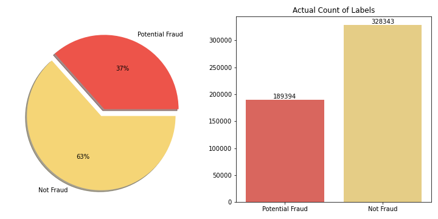
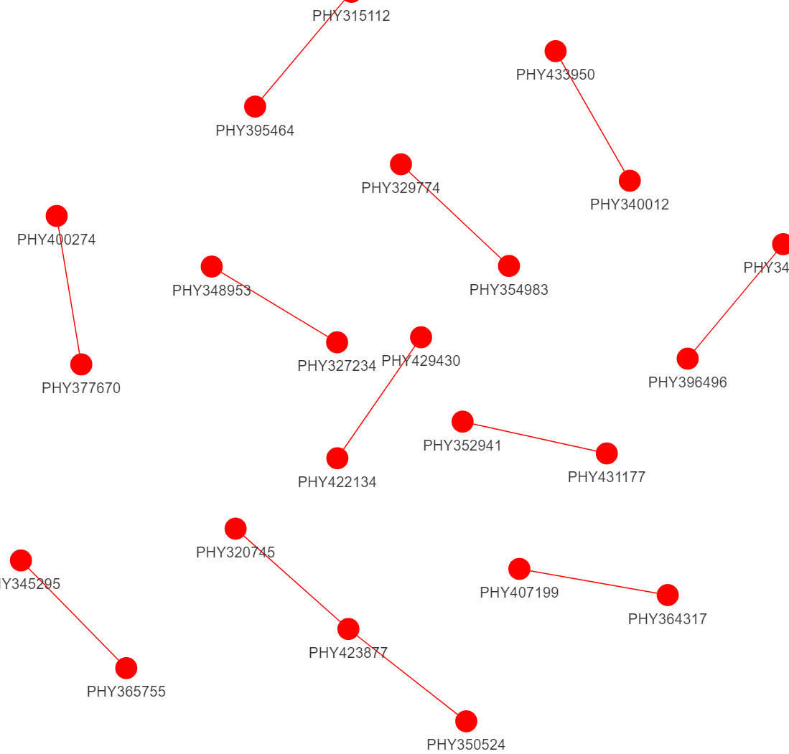
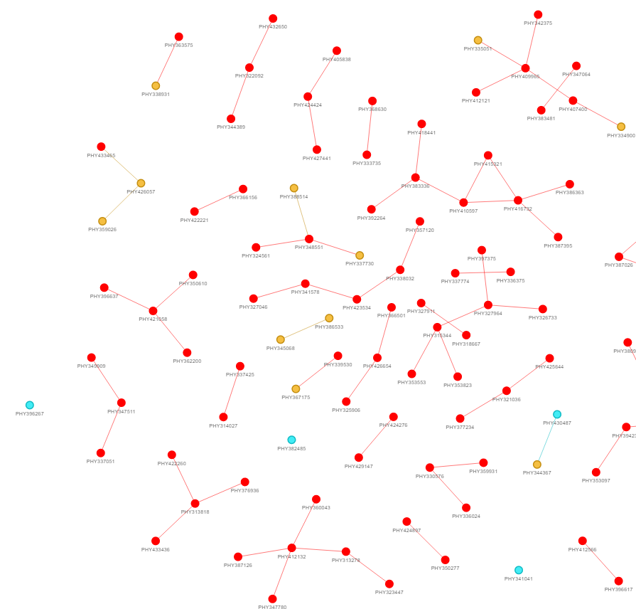

# Healthcare Fraud Analysis Project

Please understand that the analysis is designed to run on the full size of the datasets. By only sampling around 100 records from inpatient and outpatient datasets is very likely to encounter analysis errors from the notebooks. In addition, the notebooks contain more analysis besides the results in the report. 

## Screenshot of partial results

<h3>Inpatient Dataset Overview</h3>

<h3>Outpatient Dataset Overview</h3>

 
<h3>Knowledge Grapgh: Frequent Subgroups of Physicians who engaged in fraudulent records (Inpatient) </h3>

<h3>Knowledge Grapgh: Frequent Subgroups of Physicians who engaged in fraudulent records (Outpatient)</h3>

